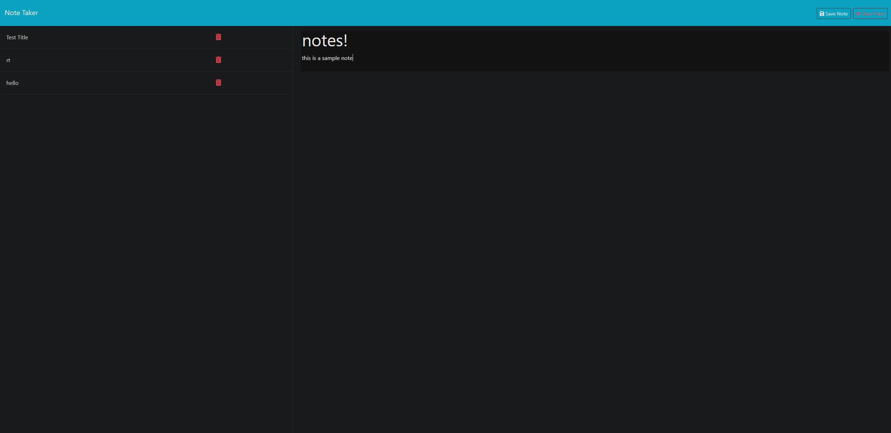

# Note Taker 

## Description
This note taker generator was built to take in content and save it into a database where it can be reselected or deleted once submitted.

## Installation
Install node.js to start, then install express.js via npm.

## Technologies
Javascript
nodeJS
npm express

## Usage
If you are using the app via VS code by way of cloning the github repo, open the server.js integrated terminal and install the required packages. To start the server enter npm start in the terminal.  Navigate to the local host port to view and interact with the application.

If using it via the render link, hit the button to get started and enter the content you wish at the form page. The user can add, select, and delete notes on the left side column.

## license
See repository for licensing information 

## links
live link:
https://notetaker-lv3v.onrender.com/

github repo:
https://github.com/RTAKA808/notetaker

screenshot:
